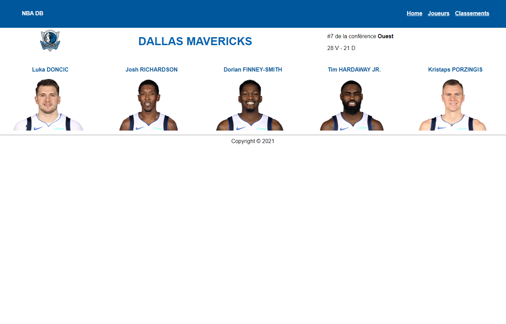

# NBA-db
Training on the MVC architecture with an app about Basketball teams, players and stats. Entrainement sur l'architecture MVC avec une app sur des joueurs, équipes et statistiques de basketball.

## Techno

- PHP
- AltoRouter
- Composer

## Screenshots

- Players list page

- Single player page

- Rankings page

- Single team page

